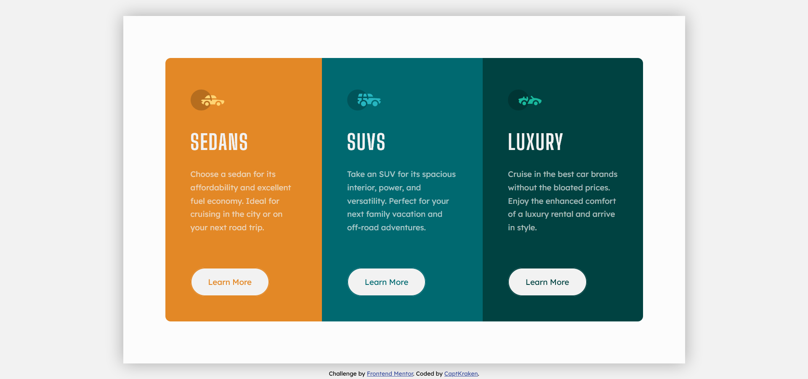

# Frontend Mentor - 3-column preview card component solution

This is a solution to the [3-column preview card component challenge on Frontend Mentor](https://www.frontendmentor.io/challenges/3column-preview-card-component-pH92eAR2-). Frontend Mentor challenges help you improve your coding skills by building realistic projects.

## Table of contents

- [Overview](#overview)
  - [The challenge](#the-challenge)
  - [Screenshot](#screenshot)
  - [Links](#links)
- [My process](#my-process)
  - [Built with](#built-with)
  - [Useful resources](#useful-resources)
- [Author](#author)

## Overview

This was a fun practice. I'm not sure if I did it right lol.

### The challenge

Users should be able to:

- View the optimal layout depending on their device's screen size
- See hover states for interactive elements

### Screenshot

### Links

- Solution URL: [This Github](https://github.com/CaptKraken/3-column-preview-card)
- Live Site URL: [3 Column Preview Card](https://captkraken.github.io/3-column-preview-card/)

## My process

Started out with HTML then went the desktop-first route. After that, started modifying things to fix the problems.

### Built with

- Semantic HTML5 markup
- Sass
- CSS Flexbox

### Useful resources

- [This Stackoverflow thread](https://stackoverflow.com/questions/31000885/align-an-element-to-bottom-with-flexbox) - This helped me keep the buttons at the bottom of the card all the times.

## Author

- Website - [My Github](https://github.com/CaptKraken)
- Frontend Mentor - [@CaptKraken](https://www.frontendmentor.io/profile/CaptKraken)
